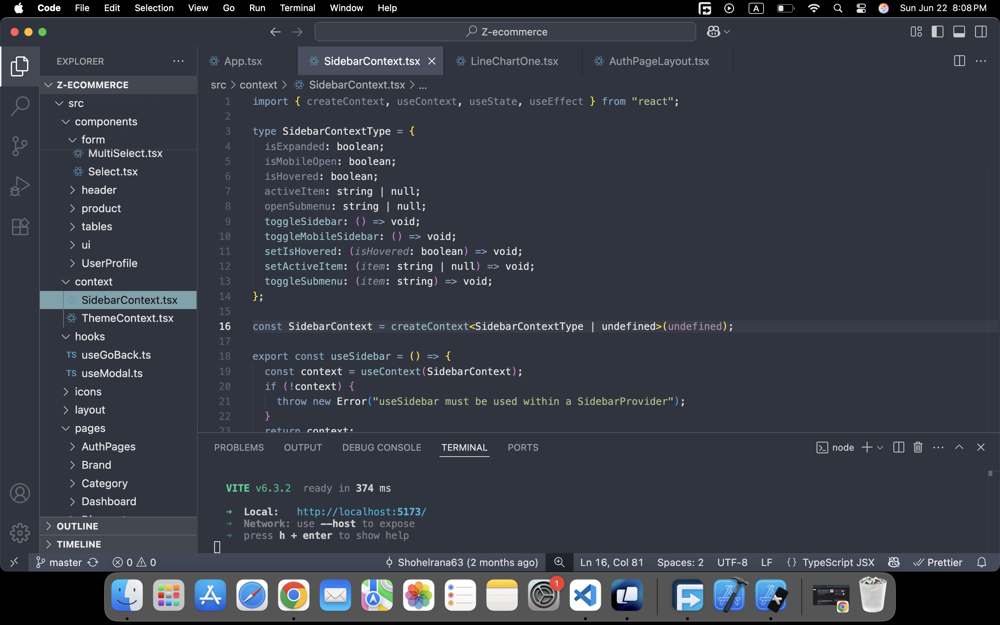

# 🌙 Baig - A Midnight Dark Theme for VS Code

**Baig** is a sleek, developer-friendly **midnight dark theme** for Visual Studio Code, crafted with care by **srbaig**.

Designed to boost focus, reduce eye strain, and enhance readability, Baig provides a smooth coding experience with vibrant syntax highlighting and balanced contrast — perfect for both frontend and backend developers.

---

## 🎨 Features

- Deep midnight background
- Carefully chosen syntax colors
- Great contrast for long coding sessions
- Supports JavaScript, TypeScript, React, HTML, CSS, Python, and more
- Optimized for readability and focus

---

## 📸 Preview



---

## 🚀 Installation

1. Go to the [Extensions Marketplace](https://marketplace.visualstudio.com/) in VS Code.
2. Search for `Baig`.
3. Click **Install**.
4. Go to `Preferences > Color Theme` and select **Baig**.

---

## 💡 Recommended Settings

To get the most out of Baig, consider these settings in your `settings.json`:

```json
"editor.fontFamily": "Fira Code, JetBrains Mono, Consolas, 'Courier New', monospace",
"editor.fontSize": 14,
"editor.lineHeight": 22,
"editor.cursorSmoothCaretAnimation": true,
"workbench.colorTheme": "Baig"
```
